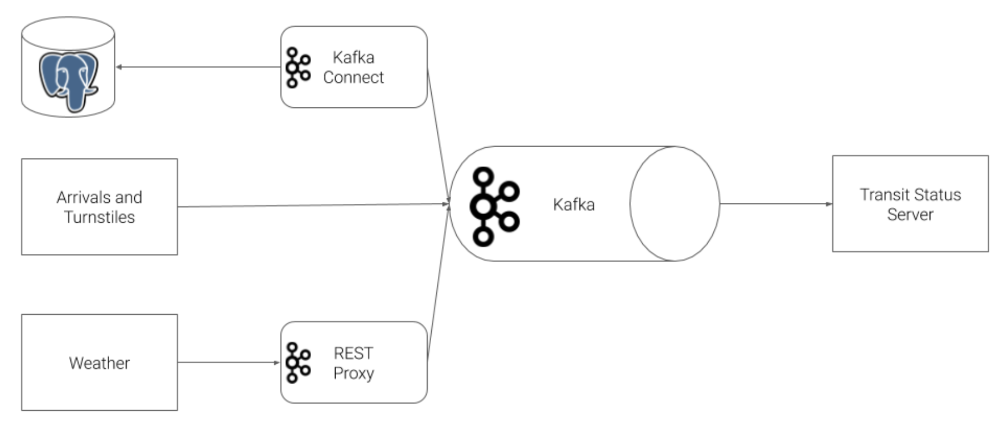

# Overview
The Chicago Transit Authority (CTA) has asked us to develop a dashboard displaying system status for its commuters. We have decided to use Kafka and ecosystem tools like REST Proxy and Kafka Connect to accomplish this task.

# Architecture

Our architecture will look like this:

As shown in the architecture diagram, the data is produced in Kafka using different methods. For example, the weather data is send to a Kafka topic using REST Proxy. The arrival and turnstile data is sent to Kafka topics using *confluent_kafka* library functions. We also have a *PostgreSQL* database which contains stations info, which is send to Kafka topics using *Kafka Connect JDBC Connector*, which is further transformed using *Faust Stream Processor*. Similarly, the turnstile data is aggregated using *KSQL*, before being consumed in the webserver.

# How to Use the Repository?

### Step 1: Install Required Packages

The version requirements to use this repository is as follows:

* **python:** *3.6 or above*
* **confluent-kafka [avro]:** *1.1.0*
* **pandas:** *0.24.2*
* **requests:** *2.22.0*
* **faust:** *1.7.4*
* **tornado:** *6.0.3*

The following pip commands can be used to installed all the required pyhton packages, needed for Kafka producers and consumers:

	>> pip install -r producers/requirements.txt
	>> pip install -r consumers/requirements.txt
	
    
### Step 2: Run Kafka Producers

The following command would create new Kafka topics and start sending the station, train arrival, turnstile and weather data to those topics. 

	>> python producers/simulation.py
	

To check if the new Kafka topics are produced successfully, run also the following command on a different tab *(optional step)*:

	>> kafka-topics --list --zookeeper localhost:2181

The following topics should be present in the list:

* *org.chicago.cta.stations*
* *org.chicago.cta.station.arrivals.v1*
* *org.chicago.cta.station.turnstile.v1*
* *org.chicago.cta.weather.v1*

To further confirm if the data is being sent to a particular topic, a Kafka CLI command can be written, for example *(optional step)*:

	>> kafka-console-consumer --bootstrap-server localhost:9092 --topic org.chicago.cta.weather.v1 --from-beginning

###  Step 3: Run the Faust Stream Processor

The following command should start the faust application, which transforms the *org.chicago.cta.stations* topic into a new faust topic *org.chicago.cta.stations.table.v1*.

	>> cd consumers
	>> faust -A faust_stream worker -l info

To check if the new faust topic is streaming the trasformed data successfully, run the following command on a different tab *(optional step)*:

	>> kafka-console-consumer --bootstrap-server localhost:9092 --topic org.chicago.cta.stations.table.v1 --from-beginning

### Step 4: Create the KSQL Table

To create a new aggregate table containing the turnstile summary, using KSQL, run the following command.

	>> python consumers/ksql.py
	
To check if the KSQL Table is created successfully, run the following command *(optional step)*:

		>> ksql
		>> SHOW TABLES;
		
You should see a new table name called **"TURNSTILE_SUMMARY"**

### Step 5: Run the Server

With all of the data in Kafka, our final task is to consume the data in the web server that is going to serve the transit status pages to our commuters. 

We need to consume data from the following Kafka topics:
* *org.chicago.cta.station.arrivals.v1* (from confluent_kafka producer)
* *org.chicago.cta.weather.v1* (from Kafka REST Proxy requests)
* *org.chicago.cta.stations.table.v1* (from Kafka connect and Faust)
* *TURNSTILE_SUMMARY* (from KSQL) 

To start the cosumtion process, run the following command.

	>> python consumers/server.py
	
    
### Step 6: Open the Transit Status Page

Open the webpage  http://localhost:8889, once all the above steps are working.

If there is no web browser installed,  the following command can be written in linux shell to install *LYNX* (you can chose any browser of your choice).

	>> sudo apt-get install lynx
	>> lynx http://localhost:8889
	
You should see in the web-browser a status page, similar to this:

## Other Resources and Documentation

In addition the following examples and documentation might be helpful:

-   [Confluent Python Client Documentation](https://docs.confluent.io/current/clients/confluent-kafka-python/#)
    
-   [Confluent Python Client Usage and Examples](https://github.com/confluentinc/confluent-kafka-python#usage)
    
- [REST Proxy API Reference](https://docs.confluent.io/current/kafka-rest/api.html)
    
-   [Kafka Connect JDBC Source Connector Configuration Options](https://docs.confluent.io/current/connect/kafka-connect-jdbc/source-connector/source_config_options.html)